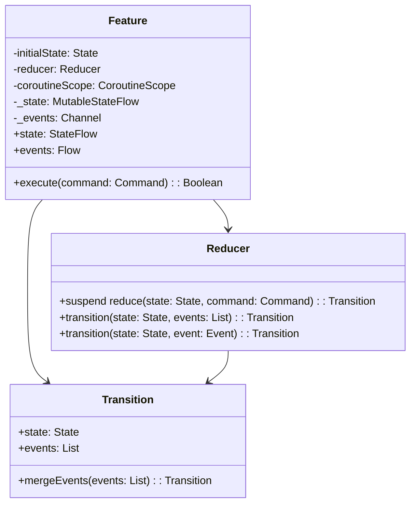

# Reduce & Conquer

*Reduce. Conquer. Repeat.*

___

## Navigation

- [About](#about)
- [Overview](#overview)
    - [State](#state)
    - [Command](#command)
    - [Event](#event)
    - [Feature](#feature)
    - [Reducer](#reducer)
    - [Transition](#transition)
- [Mathematical proof](#mathematical-proof)
- [Comparison with popular patterns](#comparison-with-popular-patterns)
    - [MVC](#model-view-controller)
    - [MVP](#model-view-presenter)
    - [MVVM](#model-view-viewmodel)
    - [MVI](#model-view-intent)
    - [Redux](#redux)
    - [The Elm Architecture](#the-elm-architecture)
    - [Event-Driven Architecture](#event-driven-architecture)
    - [Reactive Architecture](#reactive-architecture)

## About

This repository contains a proof of concept of the **Reduce & Conquer** pattern built into the Clean Architecture,
using the example of a cross-platform **Pokédex** application built using the Compose Multiplatform UI Framework.

## Overview

**Reduce & Conquer** is an architectural pattern leveraging functional programming principles and pure functions to
create predictable and testable functional components.

### State

A class or object that describes the current state of the presentation, which may contain persistent data.

### Command

A class or object that describes an action that entails updating state and/or raising events.

### Event

> Note: It's not a side effect because reduce is a pure function that returns the same result for the same
> arguments.

A class or object that describes the event caused by the execution of a command and the reduction of the presentation
state, which may contain non-persistent data.

### Feature

An abstract class that takes three type parameters: `Command`, `State` and `Event`.

#### Properties:

- `initialState`: The initial state of the feature
- `coroutineScope`: A coroutine scope that allows for asynchronous execution
- `_state`: A mutable state flow that stores the current state
- `_events`: A channel that sends events to the outside world
- `state`: A read-only state flow that exposes the current state
- `events`: A read-only flow that exposes the events emitted by the feature

### Reducer

A functional interface that takes three generic type parameters: `Command`, `State` and `Event`.  

#### Methods:

- `reduce(state: State, command: Command)`: Reduces the `State` with the given `Command` and returns a `Transition`
- `transition(state: State, events: List<Event> = emptyList())`: Constructs a `Transition` with the given `State` and
  list of `Event`s
- `transition(state: State, event: Event)`: Constructs a `Transition` with the given `State` and a single `Event`

### Transition

A data class that represents a state transition.

#### Properties:

- `state`: The new state
- `events`: A list of events emitted during the transition, which can be empty

#### Extension functions:

- `mergeEvents`: Takes a list of events and merges them with the events of a given transition.

## Mathematical Proof

### Definition

Let $S$ be the set of states, $C$ be the set of commands, and $E$ be the set of events.

We define a function $R: S \times C \rightarrow (S, E)$, which represents the reduction function that takes a state
and a command as input and returns a new state and a set of events.

### Proposition

The function $R$ satisfies the following properties:

- **Associativity**: For all $s \in S$, $c_1, c_2 \in C$, we have:
  $$R(R(s, c_1), c_2) = R(s, [c_1, c_2])$$
  where $[c_1, c_2]$ denotes the composition of commands $c_1$ and $c_2$.

- **Commutativity (under specific conditions)**: For all $s \in S$, $c_1, c_2 \in C$ such that $c_1 \circ c_2 = c_2
  \circ c_1$, we have:
  $$R(s, c_1) = R(s, c_2)$$

### Proof of Associativity

Let $s \in S$, $c_1, c_2 \in C$. We need to show that:
$$R(R(s, c_1), c_2) = R(s, c_1 \circ c_2)$$

1. **Apply Command $c_1$**:
   $$R(s, c_1) = (s_1, e_1)$$
   where $s_1$ is the new state and $e_1$ is the event generated by applying $c_1$ to state $s$.

2. **Apply Command $c_2$ to the New State $s_1$**:
   $$R(s_1, c_2) = (s_2, e_2)$$
   where $s_2$ is the new state after applying $c_2$ to $s_1$ and $e_2$ is the event generated.

3. **Sequential Application of Commands $c_1$ and $c_2$**:
   $$R(s, c_1 \circ c_2) = (s_2, e_1 \cup e_2)$$
   where $c_1 \circ c_2$ denotes applying $c_1$ first, resulting in $s_1$ and $e_1$, and then applying $c_2$
   to $s_1$, resulting in $s_2$ and $e_2$.

Since both $R(R(s, c_1), c_2)$ and $R(s, c_1 \circ c_2)$ yield the same state $s_2$ and the combined events $e_1
\cup e_2$, we have:
$$R(R(s, c_1), c_2) = R(s, c_1 \circ c_2)$$

This shows that the reduction function satisfies associativity in the context of command composition.

### Proof of Commutativity

For commutativity under specific conditions where commands are commutative:

Let $s \in S$, $c_1, c_2 \in C$. We need to show that:
$$R(s, c_1 \circ c_2) = R(s, c_2 \circ c_1)$$

1. **Apply Command $c_1$ and then $c_2$**:
   $$R(s, c_1) = (s_1, e_1)$$
   $$R(s_1, c_2) = (s_2, e_2)$$
   where $s_2$ is the state resulting from applying $c_2$ to $s_1$ and $e_2$ is the event generated.

2. **Apply Command $c_2$ and then $c_1$**:
   $$R(s, c_2) = (s_1', e_1')$$
   $$R(s_1', c_1) = (s_2', e_2')$$
   where $s_2'$ is the state resulting from applying $c_1$ to $s_1'$ and $e_2'$ is the event generated.

Since $c_1$ and $c_2$ are commutative (i.e., $c_1 \circ c_2 = c_2 \circ c_1$), the states and events should be the
same:
$$(s_2, e_1 \cup e_2) = (s_2', e_1' \cup e_2')$$

Thus, we have:
$$R(s, c_1 \circ c_2) = R(s, c_2 \circ c_1)$$

This demonstrates the commutativity of the reduction function under the specific condition of commutative commands.

### Conclusion

We have successfully proved that the reduction function $R$ satisfies both associativity and commutativity under the
given conditions.
This ensures that the reduction function behaves predictably and consistently when applying commands in different
sequences, which is essential for ensuring the correctness and reliability of the system.

The associativity property ensures that the order in which commands are applied does not affect the final state and
events, while the commutativity property ensures that commands can be applied in any order without affecting the result
under specific conditions.
These properties provide a solid foundation for ensuring the correctness and reliability of the system, influencing its
design and maintenance.

## Comparison with popular patterns

### Model-View-Controller

The _MVC_ pattern separates concerns into three parts: `Model`, `View`, and `Controller`. 
The `Model` represents the data, the `View` represents the UI,
and the `Controller` handles user input and updates the `Model`. 
In contrast, the _Reduce & Conquer_ combines the `Model` and `Controller` into a single unit.

### Model-View-Presenter

The _MVP_ pattern is similar to _MVC_,
but it separates concerns into three parts: `Model`, `View`, and`Presenter`. 
The `Presenter` acts as an intermediary between the `Model` and `View`, handling user input and updating
the `Model`. 
The _Reduce & Conquer_ is more lightweight than _MVP_, as it does not require a separate `Presenter` layer.

### Model-View-ViewModel

The _MVVM_ pattern is similar to _MVP_,
but it uses a `ViewModel` as an intermediary between the `Model`and `View`. 
The `ViewModel` exposes data and commands to the `View`, which can then bind to them. 
The _Reduce & Conquer_ is more flexible than _MVVM_, as it does not require a separate `ViewModel` layer.

### Model-View-Intent

The _MVI_ pattern is similar to _MVVM_,
but it uses an `Intent` as an intermediary between the `Model` and`View`. 
The `Intent` represents user input and intent, which is then used to update the `Model`. 
The _Reduce & Conquer_ is more simple than _MVI_, as it does not require an `Intent` layer.

### Redux

The _Redux_ pattern uses a global store to manage application state. 
Actions are dispatched to update the store, which then triggers updates to connected components. 
The _Reduce & Conquer_ uses a local state flow instead of a global store,
which makes it more scalable for large applications.

### The Elm Architecture

The _TEA_ pattern uses a functional programming approach to manage application state. 
The architecture consists of four parts: `Model`, `Update`, `View`, and `Input`. 
The `Model` represents application state,
`Update` functions update the `Model` based on user input and commands,
`View`functions render the `Model` to the UI, and `Input` functions handle user input. 
The _Reduce & Conquer_ uses a similar approach to _TEA_, but with a focus on reactive programming and
coroutines.

### Event-Driven Architecture

The _EDA_ pattern involves processing events as they occur. 
In this pattern, components are decoupled from each other, and events are used to communicate between components. 
The _Reduce & Conquer_ uses events to communicate between components,
but it also provides a more structured approach to managing state transitions.

### Reactive Architecture

The _Reactive Architecture_ pattern involves using reactive programming to manage complex systems. 
In this pattern, components are designed to react to changes in their inputs. 
The _Reduce & Conquer_ uses reactive programming to manage state transitions and emit events.