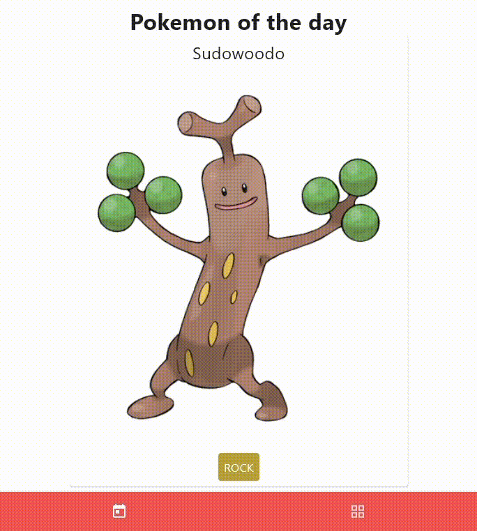
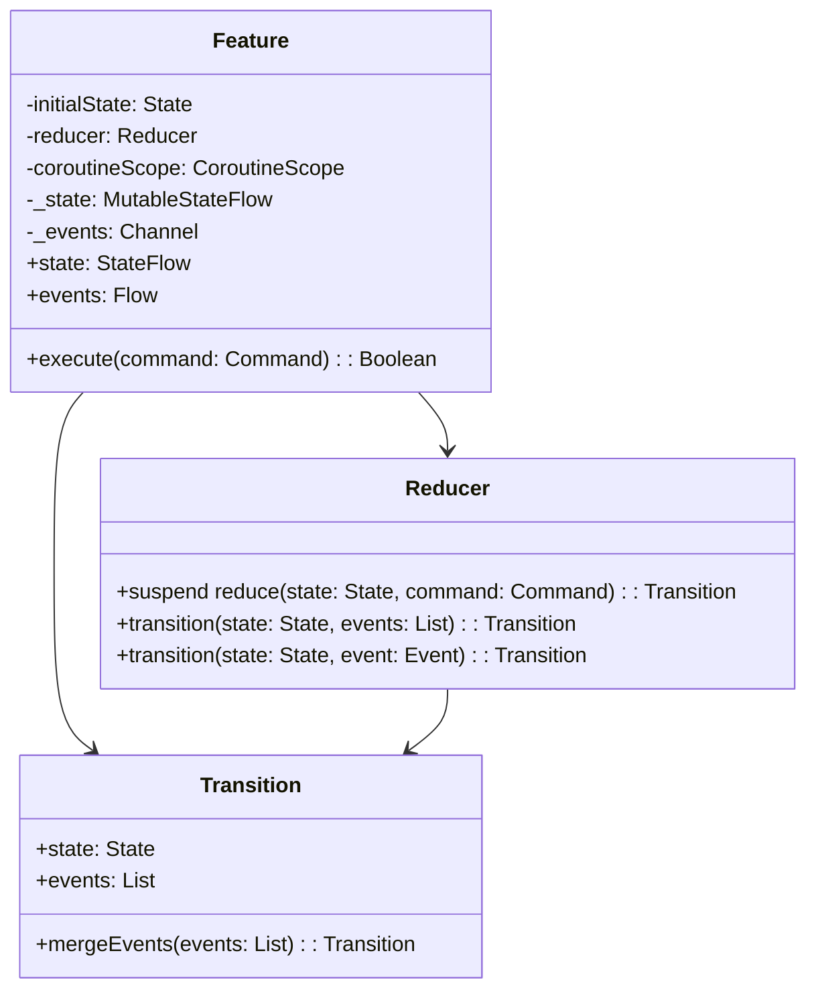

# Reduce & Conquer

*Reduce. Conquer. Repeat.*

___

## Navigation

- [About](#about)
- [Overview](#overview)
    - [State](#state)
    - [Command](#command)
    - [Event](#event)
    - [Feature](#feature)
    - [Reducer](#reducer)
    - [Transition](#transition)
- [Mathematical proof](#mathematical-proof)
- [Comparison with popular patterns](#comparison-with-popular-patterns)
    - [MVC](#model-view-controller)
    - [MVP](#model-view-presenter)
    - [MVVM](#model-view-viewmodel)
    - [MVI](#model-view-intent)
    - [Redux](#redux)
    - [The Elm Architecture](#the-elm-architecture)
    - [Event-Driven Architecture](#event-driven-architecture)
    - [Reactive Architecture](#reactive-architecture)

## About

This repository showcases the "Reduce & Conquer" architectural pattern,
which leverages functional programming principles and pure functions to create predictable and testable functional
components.
Unlike traditional architectural patterns, such as MVC or MVVM,
"Reduce & Conquer" emphasizes the separation of concerns and the use of pure functions to handle state transitions and
business logic.

This repository contains a proof of concept of the "Reduce & Conquer" pattern built into the Clean Architecture,
using the example of a cross-platform **Pokédex** application built using the Compose Multiplatform UI Framework.

## Overview

**Reduce & Conquer** is an architectural pattern leveraging functional programming principles and pure functions to
create predictable and testable functional components.

### State

A class or object that describes the current state of the presentation, which may contain persistent data.

### Command

A class or object that describes an action that entails updating state and/or raising events.

### Event

> Note: It's not a side effect because reduce is a pure function that returns the same result for the same
> arguments.

A class or object that describes the event caused by the execution of a command and the reduction of the presentation
state, which may contain non-persistent data.

### Feature

An abstract class that takes three type parameters: `Command`, `State` and `Event`.

#### Properties:

- `initialState`: The initial state of the feature
- `coroutineScope`: A coroutine scope that allows for asynchronous execution
- `_state`: A mutable state flow that stores the current state
- `_events`: A channel that sends events to the outside world
- `state`: A read-only state flow that exposes the current state
- `events`: A read-only flow that exposes the events emitted by the feature

### Reducer

A functional interface that takes three generic type parameters: `Command`, `State` and `Event`.  

#### Methods:

- `reduce(state: State, command: Command)` Reduces the `State`: with the given `Command` and returns a `Transition`
- `transition(state: State, events: List<Event> = emptyList())`: Constructs a `Transition` with the given `State` and
  list of `Event`s
- `transition(state: State, event: Event)`: Constructs a Transition with the given `State` and a single `Event`

### Transition

A data class that represents a state transition.

#### Properties:

- `state`: The new state
- `events`: A list of events emitted during the transition, which can be empty

#### Extension functions:

- `mergeEvents`: Takes a list of events and merges them with the events of a given transition.

## Mathematical Proof

Let \( s \) represent the current state, \( c \) the command, and \( t \) the transition function defined by
the `reduce` method in the `Reducer` interface.

### Definitions:

- \( s' \): New state resulting from the application of the command \( c \) to the current state \( s \).
- \( e \): Event emitted during the transition.

### Transition Function:

The transition function \( t \) can be expressed as:

\[ t: \text{Transition<State, Event>} = \text{reduce}(s, c) = (s' = f(s, c), e) \]

Where:

- \( s' \) represents the new state resulting from the application of the command \( c \) to the current state \( s \).
- \( e \) denotes the event emitted during the transition.

### Explanation:

- The `reduce` function takes the current state \( s \) and a command \( c \) as input and returns
  a `Transition<State, Event>` object.
- Inside the `reduce` function, the state transition \( s' \) is computed using a transformation function \( f \) that
  operates on the current state \( s \) and the command \( c \).
- Additionally, the event \( e \) produced during the transition is captured.

### Properties:

- **Determinism**: The transition function \( t \) yields a deterministic result for a given state \( s \) and
  command \( c \), ensuring predictability in state transitions.
- **State Immutability**: The `reduce` function maintains immutability of the original state \( s \), producing a new
  state \( s' \) without modifying the input state.
- **Event Emission**: Alongside the state transition, the `reduce` function emits an event \( e \) encapsulating side
  effects or additional information resulting from the command execution.

## Comparison with popular patterns

### Model-View-Controller

The **MVC** pattern separates concerns into three parts: `Model`, `View`, and `Controller`. 
The `Model` represents the data, the `View` represents the UI,
and the `Controller` handles user input and updates the `Model`. 
In contrast, the **Reduce & Conquer** combines the `Model` and `Controller` into a single unit.

### Model-View-Presenter

The **MVP** pattern is similar to **MVC**,
but it separates concerns into three parts: `Model`, `View`, and`Presenter`. 
The `Presenter` acts as an intermediary between the `Model` and `View`, handling user input and updating
the `Model`. 
The **Reduce & Conquer** is more lightweight than **MVP**, as it does not require a separate `Presenter` layer.

### Model-View-ViewModel

The **MVVM** pattern is similar to **MVP**,
but it uses a `ViewModel` as an intermediary between the `Model`and `View`. 
The `ViewModel` exposes data and commands to the `View`, which can then bind to them. 
The **Reduce & Conquer** is more flexible than **MVVM**, as it does not require a separate `ViewModel` layer.

### Model-View-Intent

The **MVI** pattern is similar to **MVVM**,
but it uses an `Intent` as an intermediary between the `Model` and`View`. 
The `Intent` represents user input and intent, which is then used to update the `Model`. 
The **Reduce & Conquer** is more simple than **MVI**, as it does not require an `Intent` layer.

### Redux

The **Redux** pattern uses a global store to manage application state. 
Actions are dispatched to update the store, which then triggers updates to connected components. 
The **Reduce & Conquer** uses a local state flow instead of a global store,
which makes it more scalable for large applications.

### The Elm Architecture

The **TEA** pattern uses a functional programming approach to manage application state. 
The architecture consists of four parts: `Model`, `Update`, `View`, and `Input`. 
The `Model` represents application state,
`Update` functions update the `Model` based on user input and commands,
`View`functions render the `Model` to the UI, and `Input` functions handle user input. 
The **Reduce & Conquer** uses a similar approach to **TEA**, but with a focus on reactive programming and coroutines.

### Event-Driven Architecture

The **EDA** pattern involves processing events as they occur. 
In this pattern, components are decoupled from each other, and events are used to communicate between components. 
The **Reduce & Conquer** uses events to communicate between components,
but it also provides a more structured approach to managing state transitions.

### Reactive Architecture

The **Reactive Architecture** pattern involves using reactive programming to manage complex systems. 
In this pattern, components are designed to react to changes in their inputs. 
The **Reduce & Conquer** uses reactive programming to manage state transitions and emit events.