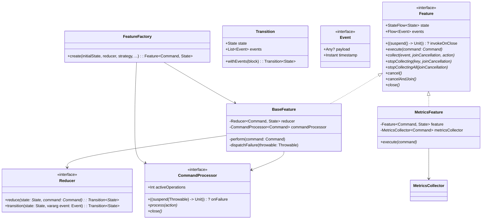

# Reduce & Conquer

*Reduce. Conquer. Repeat.*

[](https://medium.com/@numq/reduce-conquer-repeat-how-the-reduce-conquer-architecture-can-improve-your-compose-9fece98a3bb8)

[Reduce, Conquer, Repeat: How the “Reduce & Conquer” Architecture Can Improve Your Compose Application](https://medium.com/@numq/reduce-conquer-repeat-how-the-reduce-conquer-architecture-can-improve-your-compose-9fece98a3bb8)

|                                                                  🖤                                                                   |                  Support this project                   |               
|:-------------------------------------------------------------------------------------------------------------------------------------:|:-------------------------------------------------------:|
|    | <code>bc1qs6qq0fkqqhp4whwq8u8zc5egprakvqxewr5pmx</code> | 
|  | <code>0x3147bEE3179Df0f6a0852044BFe3C59086072e12</code> |
|     |     <code>TKznmR65yhPt5qmYCML4tNSWFeeUkgYSEV</code>     |

___

## Navigation

- [About](#about)
- [Changelog](#changelog)
- [Overview](#overview)
    - [State](#state)
    - [Command](#command)
    - [Event](#event)
    - [Feature](#feature)
    - [Reducer](#reducer)
    - [Transition](#transition)
- [Mathematical proof](#mathematical-proof)
    - [Definition](#definition)
    - [Proposition](#proposition)
    - [Proof of Associativity](#proof-of-associativity)
    - [Proof of Commutativity](#proof-of-commutativity)
    - [Conclusion](#conclusion)
- [Comparison with popular patterns](#comparison-with-popular-patterns)
    - [MVC](#model-view-controller)
    - [MVP](#model-view-presenter)
    - [MVVM](#model-view-viewmodel)
    - [MVI](#model-view-intent)
    - [Redux](#redux)
    - [The Elm Architecture](#the-elm-architecture)
    - [Event-Driven Architecture](#event-driven-architecture)
    - [Reactive Architecture](#reactive-architecture)
- [Clean Architecture](#clean-architecture)
    - [Working with data flows](#working-with-data-flows)
    - [Testing](#testing)
- [Proof of concept](#proof-of-concept)
    - [Features](#features)
    - [Libraries](#libraries)
- [More examples](#more-examples)

# About

This repository contains a [proof of concept](#proof-of-concept) of the **Reduce & Conquer** pattern built into
the [Clean Architecture](#clean-architecture), using the example of a cross-platform **Pokédex** application built using
the Compose Multiplatform UI Framework.


# Changelog

## [2.0.0](https://github.com/numq/reduce-and-conquer/releases/tag/2.0.0)

- Command processing strategies: `Immediate`, `Channel`, `Parallel`
- Enhanced events with lifecycle management
- Built-in metrics collection
- Feature factory for easy creation

## [1.0.0](https://github.com/numq/reduce-and-conquer/releases/tag/1.0.0)

- Initial **Reduce & Conquer** pattern
- Basic `Feature`, `Reducer`, `Transition`
- Pokédex example app

# Overview

**Reduce & Conquer** is an architectural pattern leveraging functional programming principles and pure functions to
create predictable and testable functional components.



## State

> [!TIP]
> The idempotent nature of deterministic state allows you to implement functionality such as rolling back the state to a
> previous version.

A class or object that describes the current state of the presentation.

## Command

A class or object that describes an action that entails updating state and/or raising events.

## Event

> [!NOTE]
> It's not a side effect because reduce is a pure function that returns the same result for the same arguments.

A class or object that describes the **"Fire and forget"** event caused by the execution of a command and the reduction
of the presentation state.<br>

May contain a payload.

### Event Types in version 2.0.0:

- `Collectable` - for reactive data streams with lifecycle management
- `Timeout` - when command processing times out
- `Cancellation` - when command processing is cancelled
- `Failure` - when command processing fails with an exception

## Feature

An interface that takes two type parameters: Command and State.

**A functional unit** or aggregate of presentation logic within isolated functionality.

### Properties:

- `state`: A read-only state flow that exposes the current state.
- `events`: A flow that exposes the events emitted by the feature.
- `invokeOnClose`: Optional cleanup callback.

### Methods:

- `suspend execute(command: Command)`: Suspending command submission with configurable processing strategy.

- `suspend <T> collect(event: Event.Collectable<T>, joinCancellation: Boolean, action: suspend (T) -> Unit)`: Collects
  reactive data streams with automatic lifecycle management.

- `suspend <T> stopCollecting(key: T, joinCancellation: Boolean)`: Stops collecting specific stream.

- `suspend stopCollectingAll(joinCancellation: Boolean)`: Stops all active collections.

- `suspend cancel()`: Cancels current transition.

- `suspend cancelAndJoin()`: Cancels current transition and waits for completion.

- `suspend close()`: Terminates all operations and cleans up resources.

```kotlin
val feature = FeatureFactory().create(
    initialState = MyState(),
    reducer = MyReducer(),
    strategy = CommandStrategy.Parallel(limit = 4),
    debounceMillis = 300L,
    timeoutMillis = 5_000L,
    coroutineContext = Dispatchers.IO
)
```

## Command Processing Strategies

Version 2.0.0 introduces flexible command processing strategies.

### Immediate

Commands are processed immediately in a mutually exclusive manner.

### Channel

- `Unlimited`: Unlimited buffer for commands.

- `Rendezvous`: No buffer, sender waits for receiver.

- `Conflated`: Only the latest command is kept.

- `Fixed`: Fixed capacity buffer.

### Parallel

Process multiple commands in parallel with configurable concurrency limit.

## Configuration Options

- `Debouncing`: Prevent rapid successive commands (useful for frequent inputs)

- `Timeout`: Set maximum processing time per command (prevents hanging operations)

- `Coroutine Context`: Custom execution context for command processing

## Reducer

A functional interface that takes two generic type parameters: `Command` and `State`.

A **stateless component** responsible for reducing the input command to a new state and generating events.

### Methods:

- `reduce(state: State, command: Command)`: Reduces the `State` with the given `Command` and returns a `Transition`.
- `transition(state: State, vararg event: Event)`: Constructs a `Transition` with the given `State` and variadic`Event`.

## Transition

A data class that represents a state transition.

### Properties:

- `state`: The new `State`.
- `events`: A list of `Event`s emitted during the transition, which can be empty.

### Methods:

- `withEvents(block: (List<Event>) -> List<Event>)`: Transforms events using the provided block.

## Event System

Enhanced event system with built-in error handling and lifecycle management.

```kotlin
// Collect flows in feature

events.collect { event ->
    when (event) {
        is UserEvent.ObserveUsers -> collect(
            event = event, joinCancellation = false, action = { users ->
                execute(UserCommand.UpdateUsers(users = users))
            })
    }
}

// Handle different event types in Composable

val event by feature.events.collectAsState(null)

LaunchedEffect(event) {
    when (event) {
        is PokedexEvent.ScrollToStart -> gridState.animateScrollToItem(0)

        is PokedexEvent.ResetScroll -> gridState.scrollToItem(0)

        else -> Unit
    }
}
```

## Metrics Collection

Built-in metrics collection for monitoring feature performance:

```kotlin
class MyMetricsCollector : MetricsCollector<Command> {
    override fun recordSuccess(command: Command, duration: Duration) {
        // Log successful command execution
    }

    override fun recordFailure(command: Command, duration: Duration, throwable: Throwable) {
        // Log failed command execution
    }
}

val feature = MetricsFeature(
    feature = baseFeature,
    metricsCollector = MyMetricsCollector()
)
```

# Mathematical Proof

## Definition

Let $S$ be the set of states, $C$ be the set of commands, and $E$ be the set of events.

We define a function $R: S \times C \rightarrow (S, E)$, which represents the reduction function that takes a state
and a command as input and returns a new state and a set of events.

## Proposition

The function $R$ satisfies the following properties:

- **Associativity**: For all $s \in S$, $c_1, c_2 \in C$, we have:
  $$R(R(s, c_1), c_2) = R(s, [c_1, c_2])$$
  where $[c_1, c_2]$ denotes the composition of commands $c_1$ and $c_2$.

- **Commutativity (under specific conditions)**: For all $s \in S$, $c_1, c_2 \in C$ such that $c_1 \circ c_2 = c_2
  \circ c_1$, we have:
  $$R(s, c_1) = R(s, c_2)$$

## Proof of Associativity

Let $s \in S$, $c_1, c_2 \in C$. We need to show that:
$$R(R(s, c_1), c_2) = R(s, c_1 \circ c_2)$$

1. **Apply Command $c_1$**:
   $$R(s, c_1) = (s_1, e_1)$$
   where $s_1$ is the new state and $e_1$ is the event generated by applying $c_1$ to state $s$.

2. **Apply Command $c_2$ to the New State $s_1$**:
   $$R(s_1, c_2) = (s_2, e_2)$$
   where $s_2$ is the new state after applying $c_2$ to $s_1$ and $e_2$ is the event generated.

3. **Sequential Application of Commands $c_1$ and $c_2$**:
   $$R(s, c_1 \circ c_2) = (s_2, e_1 \cup e_2)$$
   where $c_1 \circ c_2$ denotes applying $c_1$ first, resulting in $s_1$ and $e_1$, and then applying $c_2$
   to $s_1$, resulting in $s_2$ and $e_2$.

Since both $R(R(s, c_1), c_2)$ and $R(s, c_1 \circ c_2)$ yield the same state $s_2$ and the combined events $e_1
\cup e_2$, we have:
$$R(R(s, c_1), c_2) = R(s, c_1 \circ c_2)$$

This shows that the reduction function satisfies associativity in the context of command composition.

## Proof of Commutativity

For commutativity under specific conditions where commands are commutative:

Let $s \in S$, $c_1, c_2 \in C$. We need to show that:
$$R(s, c_1 \circ c_2) = R(s, c_2 \circ c_1)$$

1. **Apply Command $c_1$ and then $c_2$**:
   $$R(s, c_1) = (s_1, e_1)$$
   $$R(s_1, c_2) = (s_2, e_2)$$
   where $s_2$ is the state resulting from applying $c_2$ to $s_1$ and $e_2$ is the event generated.

2. **Apply Command $c_2$ and then $c_1$**:
   $$R(s, c_2) = (s_1', e_1')$$
   $$R(s_1', c_1) = (s_2', e_2')$$
   where $s_2'$ is the state resulting from applying $c_1$ to $s_1'$ and $e_2'$ is the event generated.

Since $c_1$ and $c_2$ are commutative (i.e., $c_1 \circ c_2 = c_2 \circ c_1$), the states and events should be the
same:
$$(s_2, e_1 \cup e_2) = (s_2', e_1' \cup e_2')$$

Thus, we have:
$$R(s, c_1 \circ c_2) = R(s, c_2 \circ c_1)$$

This demonstrates the commutativity of the reduction function under the specific condition of commutative commands.

## Conclusion

We have successfully proved that the reduction function $R$ satisfies both associativity and commutativity under the
given conditions.
This ensures that the reduction function behaves predictably and consistently when applying commands in different
sequences, which is essential for ensuring the correctness and reliability of the system.

The associativity property ensures that the order in which commands are applied does not affect the final state and
events, while the commutativity property ensures that commands can be applied in any order without affecting the result
under specific conditions.
These properties provide a solid foundation for ensuring the correctness and reliability of the system, influencing its
design and maintenance.

# Comparison with popular patterns

## Model-View-Controller

The _MVC_ pattern separates concerns into three parts: `Model`, `View`, and `Controller`.<br>
The `Model` represents the data, the `View` represents the UI,
and the `Controller` handles user input and updates the `Model`.<br>
In contrast, the _Reduce & Conquer_ combines the `Model` and `Controller` into a single unit.

## Model-View-Presenter

The _MVP_ pattern is similar to _MVC_,
but it separates concerns into three parts: `Model`, `View`, and`Presenter`.<br>
The `Presenter` acts as an intermediary between the `Model` and `View`, handling user input and updating
the `Model`.<br>
The _Reduce & Conquer_ is more lightweight than _MVP_, as it does not require a separate `Presenter` layer.

## Model-View-ViewModel

The _MVVM_ pattern is similar to _MVP_,
but it uses a `ViewModel` as an intermediary between the `Model`and `View`.<br>
The `ViewModel` exposes data and commands to the `View`, which can then bind to them.<br>
The _Reduce & Conquer_ is more flexible than _MVVM_, as it does not require a separate `ViewModel` layer.

## Model-View-Intent

The _MVI_ pattern is similar to _MVVM_,
but it uses an `Intent` as an intermediary between the `Model` and`View`.<br>
The `Intent` represents user input and intent, which is then used to update the `Model`.<br>
The _Reduce & Conquer_ is more simple than _MVI_, as it does not require an `Intent` layer.

## Redux

The _Redux_ pattern uses a global store to manage application state.<br>
Actions are dispatched to update the store, which then triggers updates to connected components.<br>
The _Reduce & Conquer_ uses a local state flow instead of a global store,
which makes it more scalable for large applications.

## The Elm Architecture

The _TEA_ pattern uses a functional programming approach to manage application state.<br>
The architecture consists of four parts: `Model`, `Update`, `View`, and `Input`.<br>
The `Model` represents application state,
`Update` functions update the `Model` based on user input and commands,
`View`functions render the `Model` to the UI, and `Input` functions handle user input.<br>
The _Reduce & Conquer_ uses a similar approach to _TEA_, but with a focus on reactive programming and
coroutines.

## Event-Driven Architecture

The _EDA_ pattern involves processing events as they occur.<br>
In this pattern, components are decoupled from each other, and events are used to communicate between components.<br>
The _Reduce & Conquer_ uses events to communicate between components,
but it also provides a more structured approach to managing state transitions.

## Reactive Architecture

The _Reactive Architecture_ pattern involves using reactive programming to manage complex systems.<br>
In this pattern, components are designed to react to changes in their inputs.<br>
The _Reduce & Conquer_ uses reactive programming to manage state transitions and emit events.

# Clean Architecture

**Clean Architecture** is a software design pattern that separates the application's business logic into layers, each
with its own responsibilities.

The main idea is to create a clear separation of concerns, making it easier to maintain, test, and scale the system.


**Clean Architecture** can be represented as follows:

```kotlin
View(
    Feature(
        Reducer(
            UseCase(
                Repository(
                    Service
                )
            )
        )
    )
)
```

> [!TIP]
> Organize your package structure by overall model or functionality rather than by purpose.
> This type of architecture is called **"screaming"**.

## The architecture is composed of the following layers:

### Entities

Representing the business domain, such as users, products, or orders.

### Use Cases

Defining the actions that can be performed on the entities, such as logging in, creating an order, or updating a user.

### Interface Adapters

Handling communication between the application and external systems, such as databases, networks, or file systems.

### Frameworks and Drivers

Providing the necessary infrastructure for the application to run, such as web servers, databases, or operating systems.

`Reduce & Conquer` is a part of `Frameworks and Drivers`, as it is an architectural pattern that provides an
implementation of presentation.

> [!TIP]
> Follow the **Feature per View principle** and achieve decomposition by dividing reducers into sub-reducers.

## Working with data flows

The `Feature` class contains [methods that implement the flow mechanism](#methods), but you can also implement your own
using the principles described below.

Let's say there is a **command** that calls a **use case**, which returns a `flow` with data that needs to be stored in
the **state**.

As a container, `flow` is only useful as long as it is collected, which means it can be classified as **a one-time
payload**.

As should be done with this kind of data, `flow` must be processed using the appropriate mechanism - **events**,
which **must begin to be collected before executing the command** that returns the **event** containing `flow`.

Thus, we can set an arbitrary `flow` processing strategy, as well as **manage the lifecycle of the collector using
coroutines**, without going beyond the functional paradigm.

Here is an example implementation of flow collection:

```kotlin
data class User(val id: String)

interface UserRepository {
    suspend fun observeUsers(): Result<Flow<List<User>>>
}

class ObserveUsers(private val userRepository: UserRepository) {
    suspend fun execute() = userRepository.observeUsers()
}

data class UserState(
    val users: List<User> = emptyList(),
)

sealed interface UserCommand {
    data object ObserveUsers : UserCommand

    data class UpdateUsers(val users: List<User>) : UserCommand
}

enum class UserEventKey {
    OBSERVE_USERS
}

sealed interface UserEvent {
    data class ObserveUsers(
        override val flow: Flow<List<User>>
    ) : UserEvent, Event.Collectable<List<User>>() {
        override val key = UserEventKey.OBSERVE_USERS
    }
}

class UserReducer(
    private val observeUsers: ObserveUsers,
) : Reducer<UserCommand, UserState> {
    override suspend fun reduce(state: UserState, command: UserCommand) = when (command) {
        is UserCommand.ObserveUsers -> observeUsers.execute().fold(
            onSuccess = { flow: Flow<User> ->
                transition(state, UserEvent.ObserveUsers(flow = flow))
            },
            onFailure = { throwable ->
                transition(state, Event.Failure(throwable = throwable))
            }
        )

        is UserCommand.UpdateUsers -> transition(state.copy(users = command.users))
    }
}

class UserFeature(
    private val feature: Feature<UserCommand, UserState>
) : Feature<UserCommand, UserState> by feature {
    private val coroutineScope = CoroutineScope(Dispatchers.Default + SupervisorJob())

    init {
        coroutineScope.launch {
            events.collect { event ->
                when (event) {
                    is UserEvent.ObserveUsers -> collect(
                        event = event, joinCancellation = false, action = { users ->
                            execute(UserCommand.UpdateUsers(users = users))
                        })
                }
            }
        }
    }

    override val invokeOnClose: (suspend () -> Unit)? get() = { coroutineScope.cancel() }
}

single {
    UserFeature(
        feature = FeatureFactory().create(
            initialState = UserState(),
            reducer = UserReducer(observeUsers = get()),
            strategy = CommandStrategy.Immediate
        )
    )
}
```

The new collect method automatically manages the lifecycle of flow collections, eliminating the need for manual
coroutine management.

## Testing

It is assumed that all the important logic is contained in the `Reducer`, which means that the testing pipeline can be
roughly represented as follows:

```kotlin
val (actualState, actualEvents) = feature.execute(command)

assertEquals(expectedState, actualState)

assertEquals(expectedEvents, actualEvents)
```

With version 2.0.0, you can also test different command processing strategies and error scenarios.

# Proof of concept

A cross-platform Pokédex application built using the Compose Multiplatform UI Framework.


## Features

### Navigation feature functionality:

- Switching between Daily and Pokedex screens (functionality).

### Daily feature functionality:

- Get a Pokemon of the Day card based on the current day's timestamp

### Pokedex feature functionality:

- Getting a grid of Pokemon cards
- Search by name
- Multiple filtering by criteria
- Reset filtering
- Sorting by criteria

> [!NOTE]
> The Pokemon card is a double-sided rotating card where
> - front side contains name, image and type affiliation
> - back side contains name and hexagonal skill graph

## Libraries

- Jetpack Compose Multiplatform
- Kotlin Coroutines
- Kotlin Flow
- Kotlin AtomicFU
- Kotlin Datetime
- Kotlin Serialization Json
- Koin Dependency Injection
- Kotlin Multiplatform UUID
- Kotlin Coroutines Test
- Mockk

# More examples

- [Haskcore](https://github.com/numq/haskcore) - A modern, lightweight standalone desktop IDE with LSP support, built
  with Kotlin & Compose Desktop for Haskell development
- [StarsNoMore](https://github.com/numq/StarsNoMore) - An application for getting a summary of statistics and traffic of
  a user's GitHub repositories
- [Klarity](https://github.com/numq/Klarity) - Jetpack Compose Desktop media player library demonstration (example)
  project
- [camera-capture](https://github.com/numq/camera-capture) - Part of a project (mobile application) that provides the
  ability to take pictures with a smartphone camera and use them in the ComfyUI workflow
- [compose-desktop-media-player](https://github.com/numq/compose-desktop-media-player) - Examples of implementing a
  media (audio/video) player for Jetpack Compose Desktop using various libraries