# Reduce & Conquer

*Reduce. Conquer. Repeat.*

[](https://medium.com/@numq/reduce-conquer-repeat-how-the-reduce-conquer-architecture-can-improve-your-compose-9fece98a3bb8)

[Reduce, Conquer, Repeat: How the “Reduce & Conquer” Architecture Can Improve Your Compose Application](https://medium.com/@numq/reduce-conquer-repeat-how-the-reduce-conquer-architecture-can-improve-your-compose-9fece98a3bb8)

|                                                                  🖤                                                                   |                  Support this project                   |               
|:-------------------------------------------------------------------------------------------------------------------------------------:|:-------------------------------------------------------:|
|    | <code>bc1qs6qq0fkqqhp4whwq8u8zc5egprakvqxewr5pmx</code> | 
|  | <code>0x3147bEE3179Df0f6a0852044BFe3C59086072e12</code> |
|     |     <code>TKznmR65yhPt5qmYCML4tNSWFeeUkgYSEV</code>     |

___

## Navigation

- [About](#about)
- [Changelog](#changelog)
- [Core Principles](#core-principles)
- [Mathematical Core](#mathematical-core)
- [Universal Architecture Components](#universal-architecture-components)
- [Universal Implementation](#universal-implementation)
- [Overview](#overview)
    - [State](#state)
    - [Command](#command)
    - [Event](#Event)
    - [Effect](#effect)
    - [Feature](#feature)
    - [Reducer](#reducer)
    - [Transition](#transition)
    - [Effect System](#effect-system)
- [Mathematical proof](#mathematical-proof)
    - [Definition](#definition)
    - [Proposition](#proposition)
    - [Proof of Associativity](#proof-of-associativity)
    - [Proof of Commutativity](#proof-of-commutativity)
    - [Conclusion](#conclusion)
- [Comparison with popular patterns](#comparison-with-popular-patterns)
    - [Model-View-Controller (MVC)](#model-view-controller-mvc)
    - [Model-View-ViewModel (MVVM)](#model-view-viewmodel-mvvm)
    - [Model-View-Intent (MVI) & Redux](#model-view-intent-mvi--redux)
    - [The Elm Architecture (TEA)](#the-elm-architecture-tea)
    - [Actor Model](#actor-model)
    - [Finite State Machines (FSM)](#finite-state-machines-fsm)
    - [Command Query Responsibility Segregation (CQRS)](#command-query-responsibility-segregation-cqrs)
    - [Event-Driven Architecture (EDA)](#event-driven-architecture-eda)
- [Clean Architecture](#clean-architecture)
    - [Working with data flows](#working-with-data-flows)
    - [Testing](#testing)
- [Example (Proof of Concept)](#example-proof-of-concept)
    - [Features](#features)
    - [Libraries](#libraries)
- [More examples](#more-examples)

## About

**Reduce & Conquer** is a universal architectural pattern with formal mathematical foundations, designed for building
predictable, testable, and maintainable software systems across any platform or framework.

This repository contains a reference implementation and comprehensive [example](#example-proof-of-concept) demonstrating
how the pattern integrates with Clean Architecture, using a Pokédex application built with Compose Multiplatform as the
demonstration vehicle.

## Changelog

### [3.0.0](https://github.com/numq/reduce-and-conquer/releases/tag/3.0.0)

- **Major simplification and optimization**: Removed `Factory`, `Strategy`, `Processor`, `Metrics`.
- **Dual-system architecture**: Separated concerns between `Event` (notifications) and `Effect` (side operations).
- **Structured side effect management**: Effects now handle flow collection, deferred execution, and cancellation.
- **Simplified core**: `ReducerFeature` uses a channel for commands and a `scan` to manage state transitions.
- **Enhanced type safety**: Clear separation between events and operational effects.

### [2.0.0](https://github.com/numq/reduce-and-conquer/releases/tag/2.0.0)

- Command processing strategies: `Immediate`, `Channel`, `Parallel`
- Enhanced events with lifecycle management
- Built-in metrics collection
- Feature factory for easy creation

### [1.0.0](https://github.com/numq/reduce-and-conquer/releases/tag/1.0.0)

- Initial **Reduce & Conquer** pattern
- Basic `Feature`, `Reducer`, `Transition`
- Pokédex example app

## Core Principles

### Purity & Determinism

Business logic resides in pure functions without side effects. Given the same State and Command, you always get the same
Transition—enabling time-travel debugging, reproducible testing, and formal verification.

### Explicit Side Effects

All non-deterministic operations—network calls, database access, timers—are encapsulated in Effects. The reduction core
remains pure, while effects are managed through a structured system.

### Unidirectional Data Flow

Data flows in a single direction: **Command → Reducer → (State, Events, Effects) → Command**. This eliminates circular
dependencies and makes system behavior traceable.

### Mathematical Formalization

Every architectural decision is backed by **formal proofs**. The system's properties aren't just conventions—they're
mathematically guaranteed.

## Mathematical Core

At the heart of the pattern lies a single, pure function:

```
reduce :: (State, Command) → (State, [Event], [Effect])
```

This function must satisfy algebraic laws:

- Associativity: Sequential command application is order-independent

- Commutativity (where applicable): Parallel commands produce consistent results

- Idempotency: Repeated commands yield identical outcomes

These properties are formally proven and enable:

- Deterministic state management

- Formal verification capabilities

- Predictable system behavior

## Universal Architecture Components

The pattern defines four core abstractions that work together to form a complete system:

1. State
   The immutable representation of system state at any point in time. States are idempotent and deterministic—replaying
   the same commands always produces identical states.

2. Command
   An intention to change the system. Commands are declarative messages that describe "what should happen" without
   specifying implementation details.

3. Event
   A notification that something occurred. Events are fire-and-forget messages emitted during state transitions, useful
   for auditing, logging, or external notifications.

4. Effect
   A structured side operation. Effects manage asynchronous work, reactive streams, or external interactions while
   maintaining purity in the core reduction logic.

```mermaid
graph LR
    Command["🗒️ Command"] --> Reducer["🧮 Reducer<br/>R: S×C→(S,Ev,Ef)"]
    State["📊 State"] --> Reducer
    Reducer --> NewState["📊 New State"]
    Reducer --> Events["📨 Events"]
    Reducer --> Effects["⚡ Effects"]
    Effects -->|execute| Command
    Events -->|notify| External["🌍 External Systems"]
```



## Universal Implementation

While this repository demonstrates the pattern in Kotlin with Compose Multiplatform, **Reduce & Conquer** is
fundamentally platform-agnostic. The same mathematical principles apply across any language, framework, or domain.

<details>
<summary>Typescript</summary>

```typescript
interface Transition<S, C, E> {
    state: S;
    events: E[];
    effects: Effect<C>[];
}

type Reducer<S, C, E> = (state: S, command: C) => Transition<S, C, E>;

const useFeature = <S, C, E>(
    initialState: S,
    reducer: Reducer<S, C, E>,
    onEvent?: (event: E) => void
) => {
    const processTransition = (transition: Transition<S, C, E>) => {
        transition.events.forEach(e => onEvent?.(e));
        transition.effects.forEach(effect => {

        });
    };

    const [state, dispatch] = useReducer((currentState: S, command: C) => {
        const transition = reducer(currentState, command);

        setTimeout(() => processTransition(transition), 0);

        return transition.state;
    }, initialState);

    const execute = useCallback((command: C) => {
        dispatch(command);
    }, []);

    return {state, execute};
};
```

</details>

<details>
<summary>Swift</summary>

```swift
struct Transition<State, Command, Event> {
    let state: State
    let events: [Event]
    let effects: [Effect<Command>]
}

protocol Reducer {
    associatedtype State
    associatedtype Command
    associatedtype Event

    func reduce(state: State, command: Command) -> Transition<State, Command, Event>
}

@Observable
final class Feature<R: Reducer> {
    private(set) var state: R.State
    private let reducer: R
    
    var events: AsyncStream<R.Event> { /* ... */ }

    init(initialState: R.State, reducer: R) {
        self.state = initialState
        self.reducer = reducer
    }

    @MainActor
    func execute(_ command: R.Command) {
        let transition = reducer.reduce(state: state, command: command)
        
        self.state = transition.state
        
        transition.events.forEach { processEvent($0) }
        
        transition.effects.forEach { effect in
            Task {
                if let nextCommand = await processEffect(effect) {
                    execute(nextCommand)
                }
            }
        }
    }
}
```

</details>

<details>
<summary>Dart</summary>

```dart
class Transition<State, Command, Event> {
  final State state;
  final List<Event> events;
  final List<Effect<Command>> effects;

  Transition({
    required this.state, 
    this.events = const [], 
    this.effects = const []
  });
}

abstract class Reducer<State, Command, Event> {
  Transition<State, Command, Event> reduce(State state, Command command);
}

class Feature<State, Command, Event> {
  final Reducer<State, Command, Event> _reducer;
  final _stateController = BehaviorSubject<State>();
  
  Stream<State> get state => _stateController.stream;
  
  Feature(State initialState, this._reducer) {
    _stateController.add(initialState);
  }

  void execute(Command command) {
    final currentState = _stateController.value;
    final transition = _reducer.reduce(currentState, command);
    
    _stateController.add(transition.state);
    
    for (var effect in transition.effects) {
      _processEffect(effect);
    }
  }

  void _processEffect(Effect<Command> effect) async {
  
  }
}

class FeatureBuilder<State, Command, Event> extends StatelessWidget {
  final Feature<State, Command, Event> feature;
  final Widget Function(BuildContext context, State state, void Function(Command) execute) builder;

  const FeatureBuilder({required this.feature, required this.builder});

  @override
  Widget build(BuildContext context) {
    return StreamBuilder<State>(
      stream: feature.state,
      builder: (context, snapshot) {
        final state = snapshot.data ?? feature.initialState;
        return builder(context, state, feature.execute);
      },
    );
  }
}
```

</details>

<details>
<summary>Rust</summary>

```rust
pub struct Transition<S, C, E> {
    pub state: S,
    pub events: Vec<E>,
    pub effects: Vec<Effect<C>>,
}

pub trait Reducer: Send + Sync {
    type State;
    type Command;
    type Event;

    fn reduce(&self, state: Self::State, command: Self::Command) 
        -> Transition<Self::State, Self::Command, Self::Event>;
}

pub struct Feature<R: Reducer> {
    state: Arc<Mutex<R::State>>,
    reducer: Arc<R>,
    command_tx: mpsc::UnboundedSender<R::Command>,
}

impl<R> Feature<R> 
where 
    R: Reducer + 'static,
    R::State: Send + Clone,
    R::Command: Send,
    R::Event: Send,
{
    pub async fn execute(&self, command: R::Command) {
        let mut state_guard = self.state.lock().unwrap();
        
        let transition = self.reducer.reduce(state_guard.clone(), command);
        
        *state_guard = transition.state;
        
        drop(state_guard);

        for effect in transition.effects {
            self.process_effect(effect).await;
        }
    }
}
```

</details>

<details>
<summary>Go</summary>

```go
type Transition[S any, C any, E any] struct {
    State   S
    Events  []E
    Effects []Effect[C]
}

type Reducer[S any, C any, E any] interface {
    Reduce(state S, command C) Transition[S, C, E]
}

type Feature[S any, C any, E any] struct {
    mu      sync.RWMutex
    state   S
    reducer Reducer[S, C, E]
    commands chan C 
}

func (f *Feature[S, C, E]) Execute(command C) {
    f.commands <- command
}

func (f *Feature[S, C, E]) loop() {
    for cmd := range f.commands {
        f.mu.Lock()
        transition := f.reducer.Reduce(f.state, cmd)
        f.state = transition.State
        f.mu.Unlock()

        for _, effect := range transition.Effects {
            go f.processEffect(effect)
        }
    }
}
```

</details>

<details>
<summary>Haskell</summary>

```haskell
import Control.Monad.State
import Control.Monad.Writer
import Data.DList (DList, fromList, toList)

data SideEffects c e = SideEffects
  { outEvents  :: DList e
  , outEffects :: DList (Effect c)
  }

instance Semigroup (SideEffects c e) where
  (SideEffects e1 f1) <> (SideEffects e2 f2) = 
    SideEffects (e1 <> e2) (f1 <> f2)

instance Monoid (SideEffects c e) where
  mempty = SideEffects mempty mempty

type ReducerM s c e = c -> StateT s (Writer (SideEffects c e)) ()

emitEvent :: e -> StateT s (Writer (SideEffects c e)) ()
emitEvent e = tell $ SideEffects (fromList [e]) mempty

emitEffect :: Effect c -> StateT s (Writer (SideEffects c e)) ()
emitEffect f = tell $ SideEffects mempty (fromList [f])

counterReducer :: ReducerM Int String String
counterReducer "increment" = do
  modify (+1)
  emitEvent "Incremented"
  
counterReducer "reset" = do
  put 0
  emitEvent "ResetDone"
  emitEffect (Cancel "timer")

counterReducer _ = return ()

runReducer :: ReducerM s c e -> s -> c -> (s, [e], [Effect c])
runReducer reducer s cmd = 
  let ((_, nextState), sideEffects) = runWriter (runStateT (reducer cmd) s)
  in (nextState, toList $ outEvents sideEffects, toList $ outEffects sideEffects)
```

</details>

## Overview

**Reduce & Conquer** is a universal architectural pattern based on a rigorous mathematical model where state transitions
are
governed by pure reduction functions:

$$R: S \times C \rightarrow (S, Ev, Ef)$$

This establishes a predictable, testable, and composable foundation for software systems across any platform, framework,
or domain.


### State

> [!TIP]
> The idempotent nature of deterministic state allows you to implement functionality such as rolling back the state to a
> previous version.

A class or object that describes the current state of the functional unit (or component).

### Command

A class or object that describes an action that entails updating state and/or producing effects.

### Event

An interface that describes **events** caused by the execution of a command and the reduction of the state.

### Effect

> [!IMPORTANT]
> Effects are the primary mechanism for managing side effects in version 3.0.0. They handle reactive streams and
> deferred operations while maintaining separation from UI events.

An interface that describes **side effects** for managing asynchronous operations and reactive streams.

#### Effect Types in version 3.0.0:

- `Stream<out Command>` - for collecting reactive data streams with automatic lifecycle management
- `Action<out Command>` - for executing deferred operations with error handling
- `Cancel` - for cancelling ongoing operations by key

#### Effect Strategies

The `Effect.Stream` supports two execution strategies to manage how data flows are collected within the`ReducerFeature`:

- `Sequential`: Processes emitted commands one by one. It uses the standard collect mechanism, ensuring that every
  command from the flow is executed in the order it was received.

- `Restart`: Implements "latest-only" logic using collectLatest. If a new emission occurs before the previous command
  processing is complete, the previous job is cancelled and replaced by the new one.

#### Event vs Effect:

- **Events** are for notifications and state changes (fire-and-forget)
- **Effects** are for managing asynchronous operations and reactive streams

### Feature

An interface that takes three type parameters: `State`, `Command`, and `Event`.

**A functional unit** or aggregate of business logic within isolated functionality.

> [!NOTE]
> The `Feature` interface extends `AutoCloseable`, allowing it to be used in try-with-resources patterns (Java) or `use`
> blocks (Kotlin) for automatic resource management.

#### Properties:

- `state`: A read-only state flow that exposes the current state.
- `events`: A flow that exposes the events produced by the feature.

#### Methods:

- `suspend execute(command)`: Submits a command for processing.
- `close()`: Terminates all operations and cleans up resources.

#### Creating a Feature:

- `invoke(initialState: State, scope: CoroutineScope, reducer: Reducer<State, Command, Event>, vararg initialCommands: Command)`: Returns a standard implementation of the Feature.

##### Delegation (Recommended)

```kotlin
class SomeFeature(reducer: SomeReducer) : Feature<SomeState, SomeCommand, SomeEvent> by Feature(
    initialState = SomeState(),
    scope = CoroutineScope(Dispatchers.Default + SupervisorJob()),
    reducer = reducer,
    initialCommands = SomeCommand.LoadInitialData
)
```

##### Instantiation

```kotlin
val feature = Feature<SomeState, SomeCommand, SomeEvent>(
    initialState = SomeState(),
    scope = CoroutineScope(Dispatchers.Default + SupervisorJob()),
    reducer = SomeReducer(),
    initialCommands = SomeCommand.LoadInitialData
)
```

### ReducerFeature:

The `ReducerFeature` class provides a reference implementation:

- Uses a `Channel` for command processing with `UNLIMITED` capacity
- Processes commands sequentially using `scan` operator
- Separates events from side effects:
    - **Events** are emitted externally
    - **Effects** are processed internally (flow collections, deferred executions)
- Provides automatic cleanup when closed

### Reducer

A functional interface that takes three generic type parameters: `State`, `Command`, and `Event`.

A **stateless component** responsible for reducing the input command to a new state, events, and effects.

#### Methods:

- `reduce(state, command)`: Reduces the `State` with the given `Command` and returns a `Transition` containing new
  state, events, and effects.

- `transition(state)`: Creates a `Transition` with the given `State` and empty
  events/effects lists. This is a convenience method for creating initial transitions.

#### Helper DSL:

- `action(key, fallback, block)`: Creates an `Effect.Action`. Useful for one-off asynchronous operations like a single
  API call or database transaction.

- `stream(key, flow, strategy, fallback)`: Creates an `Effect.Stream`. It allows the feature to react to long-running
  data streams with a specific `Strategy`.

- `cancel(key)`: Creates an `Effect.Cancel`. Immediately terminates any ongoing job (`Action` or `Stream`) associated
  with the provided key.

### Transition

A data class that represents a state transition.

#### Properties:

- `state`: The new `State`.

- `events`: A list of `Event`s emitted during the transition (for notifications).

- `effects`: A list of `Effect`s produced during the transition (for side effect management).

#### Helper DSL:

- `event(event)`: Adds a single event to the transition

- `events(vararg events)`: Adds multiple events to the transition

- `effect(effect)`: Adds a single side effect to be processed

- `effects(vararg effects)`: Adds multiple side effects to the transition

### Effect System

The effect system provides structured side effect management:

```kotlin
class SomeReducer : Reducer<SomeState, SomeCommand, SomeEvent> {
    override fun reduce(state: SomeState, command: SomeCommand) = when (command) {
        is SomeCommand.LoadData -> transition(state).effect(
            stream(
                key = "data_stream",
                flow = dataRepository.observeData(),
                fallback = { throwable -> SomeCommand.HandleError(throwable) }
            )
        )

        is SomeCommand.PerformAction -> transition(state).effect(
            action(
                key = "deferred_action",
                block = {
                    val result = performComplexCalculation()
                    
                    SomeCommand.OnResult(result)
                },
                fallback = { throwable -> SomeCommand.HandleError(throwable) }
            )
        )

        is SomeCommand.Stop -> transition(state).effect(cancel(key = "data_stream"))
    }
}
```

## Mathematical Proof

### Definition

Let $S$ be the set of states, $C$ be the set of commands, $Ev$ be the set of events, and $Ef$ be the set of effects.

We define a function $R: S \times C \rightarrow (S, Ev, Ef)$, which represents the reduction function that takes a state
and a command as input and returns a new state, a set of events, and a set of effects.

### Proposition

The function $R$ satisfies the following properties:

- **Associativity**: For all $s \in S$, $c_1, c_2 \in C$, we have:
  $$R(R(s, c_1), c_2) = R(s, [c_1, c_2])$$
  where $[c_1, c_2]$ denotes the composition of commands $c_1$ and $c_2$.

- **Commutativity (under specific conditions)**: For all $s \in S$, $c_1, c_2 \in C$ such that $c_1 \circ c_2 = c_2
  \circ c_1$, we have:
  $$R(s, c_1) = R(s, c_2)$$

### Proof of Associativity

Let $s \in S$, $c_1, c_2 \in C$. We need to show that:
$$R(R(s, c_1), c_2) = R(s, c_1 \circ c_2)$$

1. **Apply Command $c_1$**:
   $$R(s, c_1) = (s_1, ev_1, ef_1)$$
   where $s_1$ is the new state, $ev_1$ are the events generated, and $ef_1$ are the effects generated by applying $c_1$
   to state $s$.

2. **Apply Command $c_2$ to the New State $s_1$**:
   $$R(s_1, c_2) = (s_2, ev_2, ef_2)$$
   where $s_2$ is the new state after applying $c_2$ to $s_1$, $ev_2$ are the events generated, and $ef_2$ are the
   effects generated.

3. **Sequential Application of Commands $c_1$ and $c_2$**:
   $$R(s, c_1 \circ c_2) = (s_2, ev_1 \cup ev_2, ef_1 \cup ef_2)$$
   where $c_1 \circ c_2$ denotes applying $c_1$ first, resulting in $s_1$, $ev_1$, and $ef_1$, and then applying $c_2$
   to $s_1$, resulting in $s_2$, $ev_2$, and $ef_2$.

Since both $R(R(s, c_1), c_2)$ and $R(s, c_1 \circ c_2)$ yield the same state $s_2$, combined events $ev_1 \cup ev_2$,
and combined effects $ef_1 \cup ef_2$, we have:
$$R(R(s, c_1), c_2) = R(s, c_1 \circ c_2)$$

This shows that the reduction function satisfies associativity in the context of command composition.

### Proof of Commutativity

For commutativity under specific conditions where commands are commutative:

Let $s \in S$, $c_1, c_2 \in C$. We need to show that:
$$R(s, c_1 \circ c_2) = R(s, c_2 \circ c_1)$$

1. **Apply Command $c_1$ and then $c_2$**:
   $$R(s, c_1) = (s_1, ev_1, ef_1)$$
   $$R(s_1, c_2) = (s_2, ev_2, ef_2)$$
   where $s_2$ is the state resulting from applying $c_2$ to $s_1$, $ev_2$ are the events generated, and $ef_2$ are the
   effects generated.

2. **Apply Command $c_2$ and then $c_1$**:
   $$R(s, c_2) = (s_1', ev_1', ef_1')$$
   $$R(s_1', c_1) = (s_2', ev_2', ef_2')$$
   where $s_2'$ is the state resulting from applying $c_1$ to $s_1'$, $ev_2'$ are the events generated, and $ef_2'$ are
   the effects generated.

Since $c_1$ and $c_2$ are commutative (i.e., $c_1 \circ c_2 = c_2 \circ c_1$), the states, events, and effects should be
the same:
$$(s_2, ev_1 \cup ev_2, ef_1 \cup ef_2) = (s_2', ev_1' \cup ev_2', ef_1' \cup ef_2')$$

Thus, we have:
$$R(s, c_1 \circ c_2) = R(s, c_2 \circ c_1)$$

This demonstrates the commutativity of the reduction function under the specific condition of commutative commands.

### Conclusion

We have successfully proved that the reduction function $R$ satisfies both associativity and commutativity under the
given conditions.
This ensures that the reduction function behaves predictably and consistently when applying commands in different
sequences, which is essential for ensuring the correctness and reliability of the system.

The associativity property ensures that the order in which commands are applied does not affect the final state, events,
and effects, while the commutativity property ensures that commands can be applied in any order without affecting the
result under specific conditions.
These properties provide a solid foundation for ensuring the correctness and reliability of the system, influencing its
design and maintenance.

## Comparison with popular patterns

### Model-View-Controller (MVC)

- **Structure**: MVC separates data (Model) from the UI (View), with a Controller mediating between them.

- **Contrast**: In **Reduce & Conquer**, the `Feature` and `Reducer` replace both the Model's state logic and the
  Controller's orchestration.

- **Advantage**: Unlike MVC, where controllers often become "massive" and maintain mutable state, the `Reducer` is a
  stateless functional interface, making the logic predictable and easy to test in isolation.

### Model-View-ViewModel (MVVM)

- **Structure**: MVVM relies on data binding and ViewModels to expose state to the UI.

- **Contrast**: While a `Feature` can be used inside a ViewModel, it is not bound to the UI lifecycle.

- **Advantage**: **Reduce & Conquer** provides a more rigid contract. MVVM often leads to fragmented logic where
  multiple functions mutate the state directly. Here, state can only change through a formal `Transition` emitted by the
  `Reducer`.

### Model-View-Intent (MVI) & Redux

- **Structure**: These patterns use a unidirectional data flow (UDF) where "Intents" or "Actions" update a global or
  local store.

- **Contrast**: **Reduce & Conquer** refines the MVI concept by strictly separating **Events** (one-time notifications)
  from **Effects** (asynchronous operations).

- **Advantage**: Redux often struggles with side effect "middleware" (like Thunk or Saga) which can be verbose. In
  **Reduce & Conquer**, the `Effect` system is built-in and type-safe, using Coroutines and `AtomicFU` to manage
  lifecycle and cancellation without external plugins.

### The Elm Architecture (TEA)

- **Structure**: TEA uses a `Model`, `Update`, and `Msg` cycle, famous for its reliability.

- **Contrast**: **Reduce & Conquer** is essentially a JVM/Kotlin adaptation of TEA, but optimized for the modern
  Coroutine-based ecosystem.

- **Advantage**: It introduces the `Effect.Stream` and `Effect.Action` types, which allow for native handling of Flow
  and suspend functions directly within the architecture, something TEA achieves through "Commands" but with less native
  support for reactive streams.

### Actor Model

- **Structure**: Actors are independent, concurrent computational units that communicate via asynchronous message
  passing. Each actor maintains its own private state and processes messages sequentially from its "mailbox."

- **Contrast**: A `Feature` operates similarly to an Actor: it encapsulates state, processes messages (`Command`) via a
  `Channel` (serving as the mailbox), and isolates its internal logic. However, **Reduce & Conquer** provides a more
  formal mathematical structure with explicit state transitions and a dedicated side effect system built directly into
  the architecture.

- **Advantage**: Unlike traditional Actor frameworks (like Akka) which require complex setup and explicit supervision
  hierarchies, **Reduce & Conquer** is lightweight and leverages Kotlin-native structured concurrency (
  `Channel.UNLIMITED` +
  `scan` operator) to guarantee thread-safe sequential processing. Crucially, while Actors often scatter business logic
  across various message handlers, **Reduce & Conquer** centralizes all transition logic in a pure `Reducer` function —
  following the mathematical model:
  $$S \times C \rightarrow (S, Ev, Ef)$$
  This makes the system deterministic, easier to debug, and far more testable than the often unpredictable emergent
  behavior of raw Actor systems.

### Finite State Machines (FSM)

- **Structure**: An FSM moves between a finite number of states based on inputs.

- **Contrast**: The `Reducer` is a mathematical implementation of a State Transition Function:
  $S \times C \rightarrow (S, Ev, Ef)$.

- **Advantage**: While many FSM libraries are purely synchronous, **Reduce & Conquer** is an "Async-FSM." It allows
  transitions to trigger long-running operations (`Effect.Stream`) that eventually feed back into the machine as new
  commands, making it ideal for complex protocols like OAuth handshakes or multi-step file processing.

### Command Query Responsibility Segregation (CQRS)

- **Structure**: CQRS separates the models for reading and writing data.

- **Contrast**: The `execute(Command)` method represents the "Write" side, while the `StateFlow` represents the "Read"
  side (the projection).

- **Advantage**: By using a `Reducer`, the "Write" logic is centralized and deterministic. The "Read" side is always a
  consistent snapshot of the state, ensuring that the UI or any consuming service never sees an intermediate or
  corrupted state.

### Event-Driven Architecture (EDA)

- **Structure**: Systems react to a stream of events.

- **Contrast**: **Reduce & Conquer** treats every input as a `Command` and can produce a stream of `Event` objects for
  external subscribers.

- **Advantage**: It provides "Structured Reactivity." Instead of a chaotic web of event listeners, every event is a
  byproduct of a state transition, providing a clear audit trail of why an event was fired.

## Clean Architecture

**Clean Architecture** is a software design pattern that separates the application's business logic into layers, each
with its own responsibilities.

The main idea is to create a clear separation of concerns, making it easier to maintain, test, and scale the system.


**Clean Architecture** can be represented as follows:

```kotlin
View(
    Feature(           // Manages Events (notifications) and Effects (side operations)
        Reducer(       // Produces State, Events, and Effects
            UseCase(
                Repository(
                    Service
                )
            )
        )
    )
)
```

> [!TIP]
> Organize your package structure by overall model or functionality rather than by purpose.
> This type of architecture is called **"screaming"**.

### The architecture is composed of the following layers:

#### Entities

Representing the business domain, such as users, products, or orders.

#### Use Cases

Defining the actions that can be performed on the entities, such as logging in, creating an order, or updating a user.

#### Interface Adapters

Handling communication between the application and external systems, such as databases, networks, or file systems.

#### Frameworks and Drivers

Providing the necessary infrastructure for the application to run, such as web servers, databases, or operating systems.

As a general-purpose pattern, `Reduce & Conquer` can be used to implement the `Presentation` Layer, coordinate
`Use Cases`, or manage state in other layers of `Clean Architecture`.

### Working with data flows

> [!NOTE]
> Although this example uses Jetpack Compose, the Feature can be easily consumed by any Flow-based system (CLI, Ktor
> server-side, etc.)

Version 3.0.0 simplifies working with data flows through the `Effect.Stream` type. The `ReducerFeature` automatically
manages the lifecycle of flow collections.

```kotlin
data class User(val id: String)

interface UserRepository {
    fun observeUsers(): Flow<List<User>>
}

data class UserState(val users: List<User> = emptyList())

sealed interface UserCommand {
    data object LoadUsers : UserCommand

    data class UpdateUsers(val users: List<User>) : UserCommand

    data class HandleError(val throwable: Throwable) : UserCommand
}

sealed interface UserEvent {
    data class NotifyError(val message: String) : UserEvent

    data class ShowSuccess(val message: String) : UserEvent
}

class UserReducer(
    private val userRepository: UserRepository,
) : Reducer<UserState, UserCommand, UserEvent> {
    override fun reduce(state: UserState, command: UserCommand) = when (command) {
        UserCommand.LoadUsers -> transition(state).effect(
            stream(
                key = "users_flow",
                flow = userRepository.observeUsers().map(UserCommand::UpdateUsers),
                fallback = { throwable -> UserCommand.HandleError(throwable) }
            )
        )

        is UserCommand.UpdateUsers -> transition(state.copy(users = command.users)).event(UserEvent.ShowSuccess("Users updated"))

        is UserCommand.HandleError -> transition(state).event(UserEvent.NotifyError("Error: ${command.throwable.message}"))
    }
}

class UserFeature(reducer: UseReducer) : Feature<UserState, UserCommand, UserEvent> by Feature(
    initialState = UserState(),
    scope = CoroutineScope(Dispatchers.Default + SupervisorJob()),
    reducer = reducer,
    initialCommands = UserCommand.LoadUsers
)

@Composable
fun UserScreen(feature: UserFeature) {
    val state by feature.state.collectAsState()

    LaunchedEffect(Unit) {
        feature.events.collect { event ->
            when (event) {
                is UserEvent.NotifyError -> {
                    // Show error notification
                    showSnackbar(event.message)
                }
            }
        }
    }

    // UI rendering...
}
```

### Testing

It is assumed that all the important logic is contained in the `Reducer`, which means that the testing pipeline can be
roughly represented as follows:

```kotlin
val reducer = MyReducer()

val (actualState, actualEvents, actualEffects) = reducer.reduce(initialState, command)

assertEquals(expectedState, actualState)
assertEquals(expectedEvents, actualEvents)
assertEquals(expectedEffects, actualEffects)
```

## Example (Proof of Concept)


A cross-platform Pokédex application demonstrating the **Reduce & Conquer** architecture in practice.
This proof of concept validates the mathematical foundations while providing a real-world implementation.


### Features

#### Navigation feature functionality:

- Switching between Daily and Pokedex screens (functionality).

#### Daily feature functionality:

- Get a Pokemon of the Day card based on the current day's timestamp

#### Pokedex feature functionality:

- Getting a grid of Pokemon cards
- Search by name
- Multiple filtering by criteria
- Reset filtering
- Sorting by criteria

> [!NOTE]
> The Pokemon card is a double-sided rotating card where
> - front side contains name, image and type affiliation
> - back side contains name and hexagonal skill graph

### Libraries

- Jetpack Compose Multiplatform
- Kotlin Coroutines
- Kotlin Flow
- Kotlin AtomicFU
- Kotlin Datetime
- Kotlin Serialization Json
- Koin Dependency Injection
- Kotlin Multiplatform UUID
- Kotlin Coroutines Test
- Mockk

## More examples

- [Haskcore](https://github.com/numq/haskcore) - A modern, lightweight standalone desktop IDE with LSP support, built
  with Kotlin & Compose Desktop for Haskell development
- [StarsNoMore](https://github.com/numq/StarsNoMore) - An application for getting a summary of statistics and traffic of
  a user's GitHub repositories
- [Klarity](https://github.com/numq/Klarity) - Jetpack Compose Desktop media player library demonstration (example)
  project
- [camera-capture](https://github.com/numq/camera-capture) - Part of a project (mobile application) that provides the
  ability to take pictures with a smartphone camera and use them in the ComfyUI workflow
- [compose-desktop-media-player](https://github.com/numq/compose-desktop-media-player) - Examples of implementing a
  media (audio/video) player for Jetpack Compose Desktop using various libraries